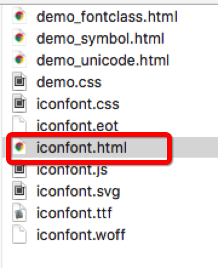
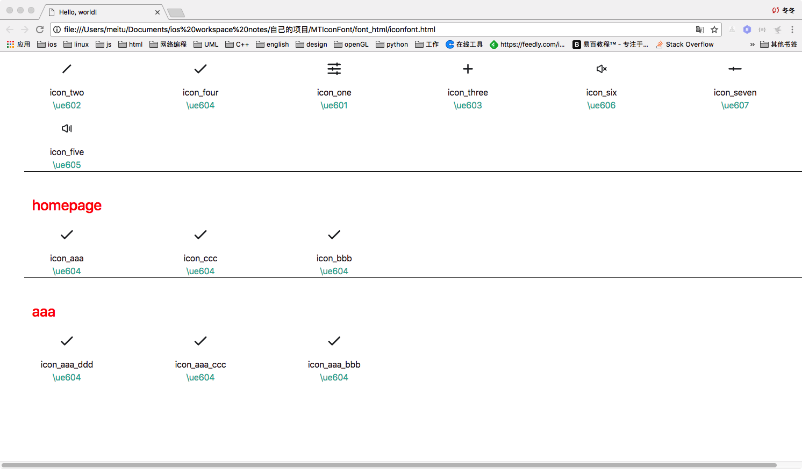
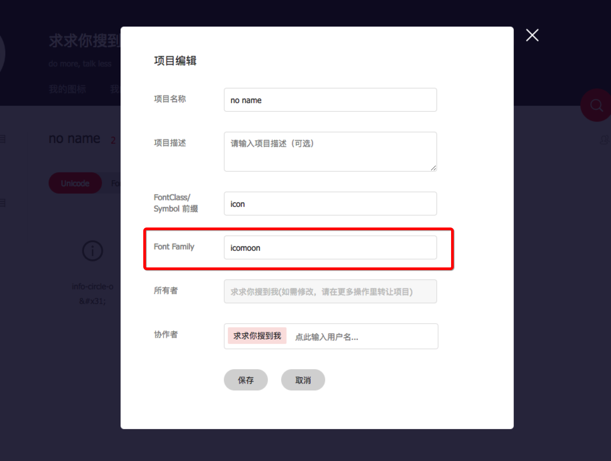

MTIconFont
-------
## 目录
* [简介](#简介)
* [相比于GitHub上的IconFont新特性](#相比于GitHub上的IconFont新特性)
* [使用指南](#使用指南)
  * [必要条件](#必要条件)
  * [Cocoapod导入](#Cocoapod导入)
  * [文件介绍](#文件介绍)
  * [使用方式](#使用方式)
  * [python脚本](#python脚本)
* [注意点](#注意点)
* [结语](#结语)

## 简介

IconFont是一种通过字体文件来构建纯色图的方案。更详细的介绍参见[使用IconFont减小iOS应用体积](http://johnwong.github.io/mobile/2015/04/03/using-icon-font-in-ios.html)。简单说来其目的是：

1. 减小应用体积，字体文件比图片要小
1. 图标保真缩放，解决2x/3x乃至将来nx图问题
1. 方便更改颜色大小，图片复用

局限性在于只支持纯色图，但是在扁平化的今天纯色图变得越来越多。

## 相比于GitHub上的IconFont新特性
1. 使用更加简单，多种方式
2. 可以添加多个字体库
3. 使用 `NSCache` 缓存，避免多次调用 `CoreGraphics` 生成图片
4. 可以自己选择是否添加 `plist` 映射文件，避免直接使用 `unicode` 提高可读性
5. 可通过 `iconfontParse.py` 脚本对 `plist` 文件生成映射网页，提高review效率

## 使用指南

### 必要条件
	Xcode 5
	iOS 6.0 +
	ARC enabled
	CoreText framework

### Cocoapod导入
	pod 'MTIconFont', '~> 0.0.3'
	
### 文件介绍
> `iconfont.ttf`

用于存储图标的字体文件
	
> `iconfont.plist` 

1. 用于映射文件名和unicode的关系，例如 `icon_one = \ue601` 
2. 使用映射文件使得代码图标名字可读性高。
3. 可对映射文件进行分组，会自动递归遍历所有字典。
4. 可不添加plist映射文件位置，直接使用 `unicode` 添加

### 使用方式

> 注册

```objc
	#import <MTIconFont/MTIconFont.h>
	
	/// 1. 初始化，也可以不初始化
	/// 2. 如果不初始化，将自动去搜索 MainBundle 中的iconfont.ttf文件和iconfont.plist文件
    NSString *iconFontUrlStr = [[NSBundle mainBundle].bundlePath stringByAppendingPathComponent:@"iconfont.ttf"];
    NSString *iconFontMapFileUrlStr = [[NSBundle mainBundle].bundlePath stringByAppendingPathComponent:@"iconfont.plist"];
    [MTIconFontManager initializeWithIconFontUrlStr:iconFontUrlStr iconFontMapFileUrlStr:iconFontMapFileUrlStr];
    
    // 注册新的字体文件
    NSString *waterMarkUrlStr = [[NSBundle mainBundle].bundlePath stringByAppendingPathComponent:@"icomoon.ttf"];
    [MTIconFontManager.manager registerWithFontPath:waterMarkUrlStr plistPath:@""];
```

> 使用

```objc
	#import <MTIconFont/MTIconFont.h>

	// 1. 使用指定字体生成图片
    self.iconImageView.image = [UIImage imageWithFontName:@"icomoon" iconName:@"12 34 56" size:50 colorRGB:0x4a4a4a alpha:1];
    
    // 2. 使用默认字体iconfont，或者初始化的字体。PS：如果未初始化，则会自动初始化iconfont字体
    self.imageView.image = [UIImage imageWithIconName:@"icon_one" size:50 colorRGB:0x4a4a4a alpha:1];
    
    // 3. 使用/的表达式生成图片
    [self.btn setImage:[UIImage imageNormalIconName:@"icon_aaa/50/0x7bc610"] forState:UIControlStateNormal];
    [self.btn setImage:[UIImage imageHighlightedIconName:@"icon_four/50/0x7bc610"] forState:UIControlStateHighlighted];
```

### python脚本
可通过映射文件 `iconfont.plist` 生成映射网页

1. 执行脚本，设置plist路径

```objc
	cd MTIconFont/Python
	./iconfontParse.py ./iconfont.plist
```

2. 将生成的 `iconfont.html` 放入设计给的iconfont文件夹内，打开网页，此项目中的 `font_html` 文件夹



3. 页面展示


 
## 注意点
相同字体的字体库只能注册一次，使用时请注意字体库名字。如果使用的是阿里巴巴的iconfont网站生成可在font family中修改


## 结语
> 您的star，是我前进的动力^_^

